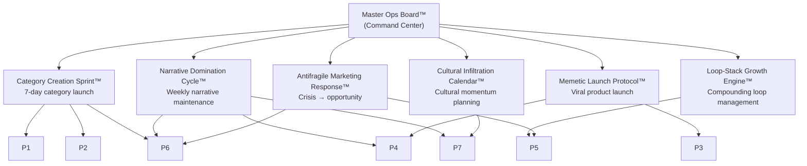
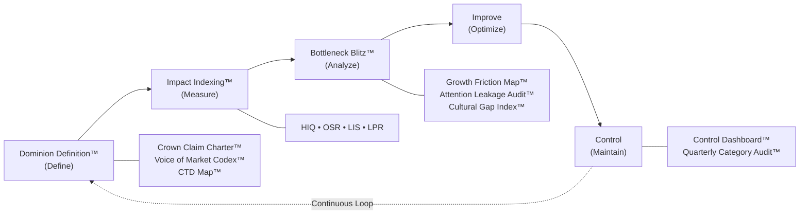

# The Freeman Method™ — Visual Architecture

## System Overview

```mermaid
flowchart TB
    subgraph CORE["THE FREEMAN METHOD™"]
        NDCC["Narrative-Driven<br/>Category Creation (NDCC)"]
        TAG["Don't compete in markets.<br/>Create them."]
    end

    subgraph P1["PILLAR 1 — Category Gap Canvas™"]
        P1F["Find invisible markets"]
        P1T1["Opportunity Radar™"]
        P1T2["Non-Customer Map™"]
        P1T3["White Space Heatmap™"]
    end

    subgraph P2["PILLAR 2 — Zero Assumption Blueprint™"]
        P2F["Rebuild from raw truth"]
        P2T1["Assumption Slayer Checklist™"]
        P2T2["Market Rebuild Canvas™"]
        P2T3["Feasibility-to-Momentum Model™"]
    end

    subgraph P3["PILLAR 3 — Remarkability Trigger Matrix™"]
        P3F["Design talk-worthiness"]
        P3T1["Talkability Scorecard™"]
        P3T2["Hook Forge™"]
        P3T3["PR Magnet Map™"]
    end

    subgraph P4["PILLAR 4 — Contagion Engine™"]
        P4F["Engineer self-spreading ideas"]
        P4T1["Idea Virus Blueprint™"]
        P4T2["Meme Payload Builder™"]
        P4T3["Cultural Injection Checklist™"]
    end

    subgraph P5["PILLAR 5 — Loop Leverage Protocol™"]
        P5F["Exponential growth loops"]
        P5T1["Loop Builder Canvas™"]
        P5T2["Viral Backlash Plan™"]
        P5T3["Momentum Multiplier Sheet™"]
    end

    subgraph P6["PILLAR 6 — Market Lexicon Playbook™"]
        P6F["Control the words"]
        P6T1["Language Lock™"]
        P6T2["Lexicon Expansion Map™"]
        P6T3["Terminology Dominance Tracker™"]
    end

    subgraph P7["PILLAR 7 — Cultural Gravity Map™"]
        P7F["Anchor into culture"]
        P7T1["Context Clustering Grid™"]
        P7T2["Cultural Touchpoint Calendar™"]
        P7T3["Brand Embedding Checklist™"]
    end

    NDCC --> P1 & P2 & P3 & P4 & P5 & P6 & P7
    P1 --> P1F --> P1T1 & P1T2 & P1T3
    P2 --> P2F --> P2T1 & P2T2 & P2T3
    P3 --> P3F --> P3T1 & P3T2 & P3T3
    P4 --> P4F --> P4T1 & P4T2 & P4T3
    P5 --> P5F --> P5T1 & P5T2 & P5T3
    P6 --> P6F --> P6T1 & P6T2 & P6T3
    P7 --> P7F --> P7T1 & P7T2 & P7T3
```

---

## Process Flow (4 Phases)

```mermaid
flowchart LR
    subgraph PHASE1["Phase 1 — Discovery"]
        D1["Category Gap Canvas™"]
        D2["Zero Assumption Blueprint™"]
    end

    subgraph PHASE2["Phase 2 — Creation"]
        C1["Category Naming"]
        C2["Remarkability Trigger Matrix™"]
        C3["Market Lexicon Playbook™"]
    end

    subgraph PHASE3["Phase 3 — Spread"]
        S1["Contagion Engine™"]
        S2["Loop Leverage Protocol™"]
    end

    subgraph PHASE4["Phase 4 — Domination"]
        DOM1["Narrative Monopoly"]
        DOM2["Cultural Gravity Map™"]
        DOM3["Antifragile Response"]
    end

    PHASE1 --> PHASE2 --> PHASE3 --> PHASE4
    PHASE4 -.->|"Quarterly Audit"| PHASE1
```

---

## SOP Operating Layer

---

## Precision Growth Architecture (PGA)

---

## Pillar → Tool → SOP Chain

| Pillar | Framework | Output Tools | Primary SOP |
|--------|-----------|--------------|-------------|
| 1 | Category Gap Canvas™ | Opportunity Radar™, Non-Customer Map™, White Space Heatmap™ | Category Creation Sprint™ |
| 2 | Zero Assumption Blueprint™ | Assumption Slayer™, Market Rebuild Canvas™, Feasibility Model™ | Category Creation Sprint™ |
| 3 | Remarkability Trigger Matrix™ | Talkability Scorecard™, Hook Forge™, PR Magnet Map™ | Memetic Launch Protocol™ |
| 4 | Contagion Engine™ | Idea Virus Blueprint™, Meme Payload Builder™, Cultural Injection™ | Memetic Launch Protocol™ |
| 5 | Loop Leverage Protocol™ | Loop Builder Canvas™, Viral Backlash Plan™, Momentum Multiplier™ | Loop-Stack Growth Engine™ |
| 6 | Market Lexicon Playbook™ | Language Lock™, Lexicon Expansion™, Terminology Tracker™ | Narrative Domination Cycle™ |
| 7 | Cultural Gravity Map™ | Context Clustering™, Touchpoint Calendar™, Brand Embedding™ | Cultural Infiltration Calendar™ |

---

Open [architecture.html](architecture.html) in a browser for an interactive visual version.
