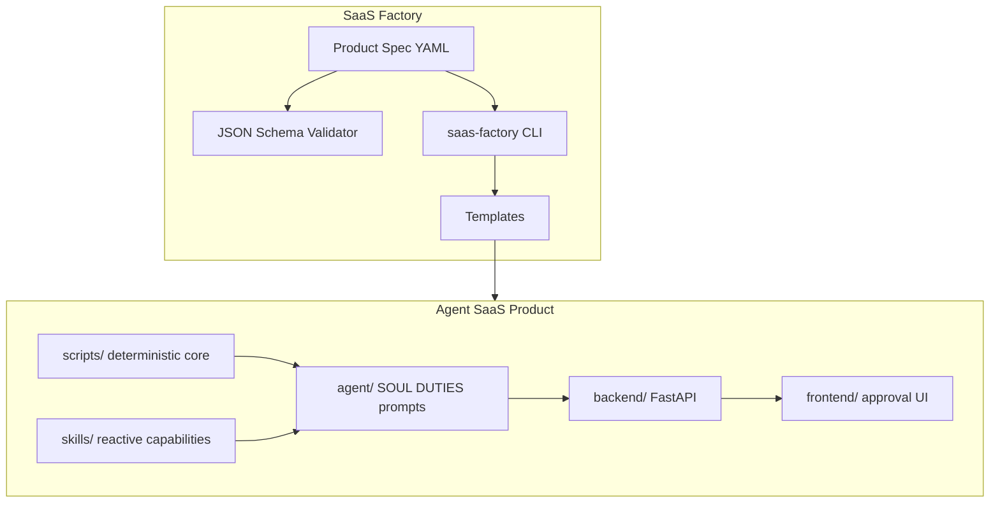

# SaaS Factory Architecture

## Problem

Building agent SaaS products one-off leads to inconsistent safety properties, duplicated scaffolding, and unclear boundaries between model output and binding facts.

The factory treats each product as a **spec → scaffold → implement** pipeline with shared governance.

## Factory layers

## Architecture selection

The factory supports three architecture modes in product specs:

| Mode | When to use | Example |
|------|-------------|---------|
| `single-agent` | Fixed sequential pipeline, predictable stages, pre-revenue token budget | AI Proposals Agent |
| `multi-agent` | Many specialized roles behind one approval UI, customer buys bundles | Freeman Intel |
| `hybrid` | Single orchestrator + specialist sub-agents for parallel intake | Future products |

Selection follows the same four-factor gate as ADR-001:

1. Control level required
2. Problem complexity
3. Resource constraints (token economics)
4. Domain expertise

Document the decision in `docs/ADR-*.md` inside each product.

## Binding facts contract

Every factory product must declare:

- **Deterministic modules** — Python scripts that own binding facts
- **Hard rules** — evaluated before any agent step (see `agent/DUTIES.md`)
- **Run log schema** — `schemas/run-log.schema.json`

The model may only generate narrative, structure, and drafts that reference traced values.

## Human approval model

| Impact class | Default mode |
|--------------|--------------|
| Internal alert | Auto |
| Draft for review | Approve before send |
| Export to external system | Approve |
| Binding fact override | Never — HALT instead |

Freeman Intel maps menu items to approval modes per `agent-menu.md`. New products encode this in pipeline stage `mode: human`.

## Observability

All products emit:

- Stage timings
- Token counts (where LLM is used)
- Halt reasons with source pointers
- `*trace` links from output fields to KB records or script outputs

## Monorepo integration

Registered products live at the monorepo root (`freeman-intel/`, `ai-proposals-agent/`). The factory `path` field in each spec points to the live directory. Scaffold output defaults to monorepo root for greenfield products.
